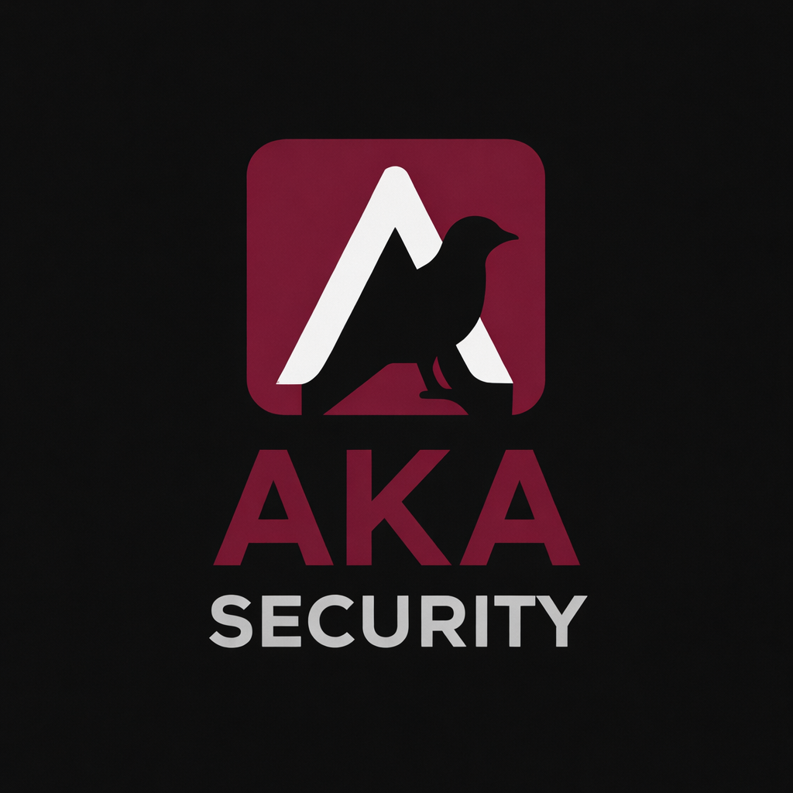

# AKA SECURITY

**Kurumsal Siber Güvenlik Çözümleri**

---

## 🛡️ Hakkımızda

**AKA Security**, kurumların siber güvenlik süreçlerini daha görünür, yönetilebilir ve sürdürülebilir hale getirmek amacıyla kurulmuş profesyonel bir siber güvenlik firmasıdır.

Odağımız; teknik doğruluk ile kurumsal ihtiyaçlar arasında dengeli ve uygulanabilir çözümler üretmektir. Her projede yalnızca zafiyet tespiti değil, aynı zamanda risklerin doğru önceliklendirilmesi ve kapatılmasına yönelik yol haritası sunmayı hedefleriz.

Finans, e-ticaret, kurumsal IT ve regülasyonlu sektörler başta olmak üzere farklı alanlarda edindiğimiz saha deneyimiyle güvenliği teorik değil, doğrudan uygulanabilir bir disiplin olarak ele alıyoruz.

---

## 📊 Rakamlarla AKA Security

| | |
|---|---|
| 🔍 **60+** | Sızma testi ve güvenlik değerlendirmesi |
| 🚨 **25+** | Siber olay müdahalesi ve iyileştirme süreci |
| 📋 **40+** | Kurumsal güvenlik analizi ve raporlama |
| 🏭 **15+** | Yıllık sektör deneyimi |

---

## 🔧 Hizmetler

### 🔍 Sızma Testi (Penetration Testing)
Uygulama, ağ ve altyapı yüzeylerinde kontrollü güvenlik doğrulaması gerçekleştirilir. Kurumsal saldırı yüzeyini görünür hale getirerek kritik risklerin önceliklendirilmesini sağlarız.

- Web Application Security Testing
- Internal & External Network Security
- Mobile Application Security Testing

---

### ⚡ Red Teaming
Senaryo tabanlı simülasyonlar ile kurumun tespit ve müdahale kabiliyetleri gerçek saldırı senaryoları üzerinden ölçümlenir.

- Senaryo Tasarımı ve Rules of Engagement
- Tespit & Müdahale Kabiliyeti Ölçümü
- Kapsamlı Saldırı Simülasyonu

---

### 📧 Mail Security
E-posta güvenliği politikaları ve yapılandırmalarını kurumsal bakış açısıyla değerlendiririz.

- SPF / DKIM / DMARC Analizi
- Gateway Policy Review
- TLS ve Sertifika Kontrolleri

---

### 🖥️ System Security
Windows, Linux ve Unix tabanlı sistemlerin CIS benchmarkları temel alınarak denetlenmesi ve sıkılaştırılması (hardening).

- İşletim Sistemi Sıkılaştırma
- Yanlış Yapılandırma Tespiti
- Yetki Yükseltme Yüzeyinin Kapatılması

---

### 👁️ SOC & MDR
Tespit, görünürlük ve müdahale süreçlerini olgunlaştırarak savunma hattını güçlendiririz.

- 7/24 Güvenlik İzleme
- Alarm Kalitesi ve Müdahale Hızı Optimizasyonu
- Olay Müdahalesi ve Kapanış Süreçleri

---

## 🏅 Sertifikalar

| Sertifika | Kurum |
|---|---|
| OSCP — Offensive Security Certified Professional | Offensive Security |
| CEH — Certified Ethical Hacker | EC-Council |
| CISSP — Certified Information Systems Security Professional | ISC² |
| Security+ | CompTIA |
| ISO 27001 Lead Auditor | ISO |

---

## 📬 İletişim

Hizmet talepleriniz, güvenlik danışmanlığı ihtiyaçlarınız ve iş birliği fırsatları için:

- 📧 **E-posta:** [ugurk@akasecurity.com.tr](mailto:ugurk@akasecurity.com.tr)
- 💼 **LinkedIn:** [linkedin.com/company/aka-security](https://www.linkedin.com/company/aka-security/)
- 📍 **Konum:** İstanbul, Türkiye
- ⏱️ **Geri Dönüş:** 24–48 saat içinde

---

*Kurumsal siber güvenlik çözümleri • İstanbul*

**© 2026 AKA Security — Tüm hakları saklıdır.**

